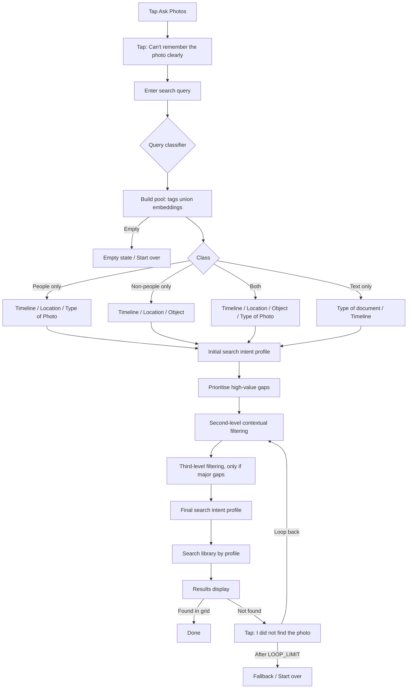

# PRD: Intent Clarifier for Google Photos (Ask Photos)

> **Purpose of this document:** Spec for a clickable, front-end-only prototype to be built in Cursor. Read the whole file before writing code. Follow the "Build Plan" section for ordering.

---

## 1. Overview

**Feature:** Intent Clarifier, an AI search enhancement inside Ask Photos. When a user can't remember a photo clearly, the AI asks a few guided multiple-choice questions (MCQs). One tap on an option adds missing context to the query, so the user never has to write a longer prompt.

**One-line problem:** The gap between what users type and what they mean.

**Prototype goal:** Demonstrate the end-to-end flow (query → classification → guided questions → results → "didn't find it" loop-back) on a mocked photo library, for a product portfolio / usability test.

**LLM usage:** An LLM is used for (a) classifying the query, (b) generating the qualifying (clarifying) questions and their options, and (c) interpreting typed answers. The photo library is a mocked dataset: **~400 Unsplash-backed photos plus ~30 synthetic document entries** (430 total, see 8.4). Images are downloaded at **build time** via the Unsplash API; **search metadata** (dates, locations, tags, demo clusters) is deterministic and authored in the library builder—not inferred from pixels at runtime. **Clarifier filtering** over that metadata is deterministic code.

**Semantic retrieval (optional, shipped):** At query submit, the app builds an initial **search pool** by unioning (1) a tag/synonym **`semanticBaseline`** match and (2) **vector similarity** over precomputed embeddings (`public/photo-embeddings.json`, built via `npm run build:embeddings`). Runtime query vectors use `POST /api/embed` (Google Gemini or Groq, see 6.7). If embeddings are unavailable, the pool falls back to the tag baseline only. MCQs and the intent profile always run **on the pool**, not necessarily the full 430-row library.

**Out of scope:** Real Google Photos integration, on-device vision over the user’s library, authentication, a production backend. The photo library is mocked client-side; server pieces are thin proxies for the LLM and query embeddings (see 6.6–6.7).

---

## 2. Problem Definition

- Users have low recall of photos, especially of **places**, and tend to type short queries (6/6 interview participants typed ≤2 words).
- AI Search takes vague queries at face value instead of inferring intent, so it surfaces hundreds of results and users must scroll heavily.
- Existing workarounds: change the query and retry, or browse the Places album trip folder manually.

### Research evidence (use for the prototype's "About" screen, optional)
| Finding | Data |
|---|---|
| Place images least recalled | 5/6 participants |
| People and animals best recalled | 4/6 participants |
| Queries of two words or fewer | 6/6 participants |
| Successful retrievals needing heavy scrolling | 33% |
| Initial failures resolved on reattempt | 2 of 5 (3 remained unsuccessful) |

### System research (competitive baseline within Google Photos, rated for retrieval from vague memory)
People & Animals 4/5, Objects 3/5, Places 2.5/5, Text 2/5. AI Search for generic queries returns hundreds of results.

---

## 3. Persona

**Rohan Mishra, 28.** Loves trekking. Wants to share a few standout landscape photos from a trip with friends. Has a 15,000+ photo library, takes ≥3 trips a year.
Quote: *"I've been to a lot of lakes. If I type 'lake', it brings up all of them, but I just want the one from last week, not all of them."*

**Target segment:** Travel enthusiasts aged 18–35.

---

## 4. Goals and Success Metrics

| Type | Metric |
|---|---|
| Primary outcome | Reduction in average query refinement rate in AI Search |
| Supporting | Fewer results to scroll before finding the photo; fewer taps and less time to retrieval |
| Business | Stronger search complements backup and editing, raising CLTV and stickiness |

**Prototype instrumentation (console and on-screen debug panel):**
- Number of clarifying questions answered / skipped ("Can't remember")
- Candidate set size after each step (e.g. 73 → 15 → 6)
- Number of loop-backs after "I did not find the photo"
- Time from query submit to results
- LLM latency per call, and number of fallbacks to rule-based logic
- Number of typed answers vs tapped options

---

## 5. User Flow (source of truth)

Implement exactly this flow.

```
1. User taps "Ask Photos"
2. User taps **"Can't remember the photo clearly"** (top-right chip on Ask Photos home)      <- entry point for the Intent Clarifier
3. User enters a search query **in the same home search bar** (placeholder becomes “Describe what you remember”; no separate query screen)
4. QUERY CLASSIFIER assigns one of four classes (LLM Call 1):
     A. People only
     B. Non-people only
     C. Both people & non-people
     D. Text only
4b. **Initial search pool** — union of tag baseline + optional embedding top-K (see 6.4.1). Apply Call 1 **extracted** attributes on this pool. If the pool is empty → empty results (no clarifier). If candidates are already ≤ **`EARLY_STOP_AT`** → skip to results (step 12).
5. FIRST-LEVEL FILTERING (questions depend on class, see 6.1)
     - Skip any question already answered in the user's query (jump ahead)
     - Every question has a "Can't remember" option
     - Timeline crawl extends to the year before and after the user's selected year
6. Initial search intent profile is created
7. Prioritise high-value gaps (pick the most informative unanswered attributes)
8. SECOND-LEVEL contextual filtering (see 6.2)
9. THIRD-LEVEL contextual filtering (ONLY if major data gaps remain)
10. Final search intent profile is created
11. Search photo library using the search intent profile
12. Results display (3-column grid; success = user identifies the photo in the grid — **no** dedicated viewer or success screen)
13b. User does not find it -> taps **"I did not find the photo"** (results bar, or clarifier when > 12 matches)
        -> **LOOPBACK** (banner: "Let's narrow it down differently.") → new contextual round (level 2 or 3, may relax filters) — not always strictly step 8
13c. After **`LOOP_LIMIT`** completed loop-back rounds, the **next** "I did not find the photo" → **Fallback** (Start over; Browse by Places is non-functional)
```

### Flow diagram (Mermaid, for reference)



---

## 6. Functional Requirements

### 6.1 First-level filtering questions (by query class)

| Class | Questions (in this default order) |
|---|---|
| **A. People only** | Timeline, Location, Type of Photo (Selfie / Portrait) |
| **B. Non-people only** | Timeline, Location, Object |
| **C. Both** | Timeline, Location, Object, Type of Photo (Selfie / Portrait) |
| **D. Text only** | Type of document, Timeline |

**Rules**
- **FR-1:** Skip a question if its answer is already inferable from the query (e.g. "lake last week" skips Timeline and Object). The LLM classification call (6.6, Call 1) returns the attributes it extracted from the query and applies them to the profile before the first question round. **Question screens do not show an “Already understood” row** (see Mockups/screens.html S3); extracted filters still appear on the **results** screen as profile pills.
- **FR-2:** Every question includes a persistent **"Can't remember"** option. It counts as answered (no filter applied) and moves on.
- **FR-3:** Question **rounds** show up to **three stacked questions** on one screen (Mockups/screens.html S3). Each question is **single-select** among chips; tap a selected chip again to clear it. Options that would leave **zero** photos are **dimmed**. A primary button at the bottom shows the live match count (e.g. **“Show 6 photos”**) and **submits the whole round**; there is no per-question Next button. **Skip** in the top bar goes straight to results.
- **FR-3a (Add detail, when needed):** Each question has a **“✎ Add detail”** chip. Tapping it opens a text field under that question only. Submitting typed text calls the LLM interpreter (6.6, Call 3), which maps the text mainly for that question but may fill others (e.g. “the island, with lily pads” selects Vancouver Island and Lily pads). Show a one-line confirmation under the field. Typed values join the **round draft** until the user submits the round. If text can't be mapped, follow the keyword path (FR-3a legacy) with the confirmation sheet (E-5.4).
- **FR-4:** **Timeline** options: Last week, Last month, Last 3 months, This year, Last year, Older, Pick a year. The crawl window extends to the year before and after any selected year. Show a subtle helper line: "Also checking 2024 and 2026".
- **FR-5:** **Location** options are drawn from locations in the mock library, ranked by frequency within the current candidate set. Show the top **`LOCATION_OPTION_CAP`** (default **3**), plus **✎ Add detail** (typed field, FR-3a) and "Can't remember". Other attributes show up to **`CHIP_OPTIONS_PER_QUESTION`** (default **3**) MCQ chips plus Add detail and Can't remember.
- **FR-6:** **Object** options come from the candidate set's object tags (e.g. Water, Mountains, Boat, Tent, Food, Sunset).
- **FR-7:** **Type of Photo:** Selfie, Portrait, Group photo, Candid.
- **FR-8:** **Type of document:** Receipt, ID / Card, Ticket, Handwritten note, Screenshot, Slides / Whiteboard.

### 6.2 Second- and third-level contextual filtering

| Class | Second level | Third level (only if major data gaps) |
|---|---|---|
| People | How many people (1, 2, 3–5, 6+); Pose and expression (Smiling, Serious, Posing, Mid-action) | Clothing colour; Background (indoors/outdoors) |
| Non-people | Time of day (Morning, Afternoon, Sunset, Night); Sky/weather (Clear, Cloudy, Foggy) | Dominant colour; Activity nearby (Trek, Boating, Camping) |
| Both | How many people; Time of day | Pose and expression; Background |
| Text | Language/script; Content type (Name, Number, Date, Address) | Layout (Printed / Handwritten); Colour of page |

- **FR-9 (Prioritise high-value gaps):** After each answer, recompute the candidate set. The next question is chosen by the LLM (6.6, Call 2) from the attributes valid for the query class and not yet answered. The prototype computes an entropy score per attribute (how evenly its values split the candidate set) and passes it to the LLM as a hint; the LLM picks the attribute that is most useful and most natural to ask. If the LLM call fails, use the highest-entropy attribute directly (see 8.3).
- **FR-10 (Early stop):** Stop asking and go to search as soon as candidate set ≤ **`EARLY_STOP_AT`** (default **12**) photos. **Contextual rounds** (level 2+, including loop-back) stop after **three questions have been shown** across the round UI (one screen may show up to three at once). The user can also tap **Skip** or the bottom **Show N photos** button when ready.
- **FR-11 (Third level gate):** Enter third-level only if, after second level, the candidate set is still > **`THIRD_LEVEL_ABOVE`** (default **30**) photos. Keep both constants in `src/config.ts`.
- **FR-12 (Loop-back):** Tapping "I did not find the photo" (from results, or from the clarifier when the match count is still > 12) enters **`LOOPBACK`**: exclude already-answered attributes (Can't remember may be re-asked once), pick the next contextual level (2 or 3), and **relax** the most restrictive prior filter when results were &lt; **`FEW_RESULTS`** (default 3). Show copy: "Let's narrow it down differently."
- **FR-13 (Loop limit):** **`LOOP_LIMIT`** (default **1**) is the number of **completed loop-back rounds** allowed. On the **next** "I did not find the photo" after that, show **`FallbackScreen`**: "Still not found?", non-functional **Browse by Places**, and **Start over**. (Equivalently: one loop-back cycle, then fallback on the second not-found tap.)

### 6.3 Search intent profile

A visible, human-readable summary pill row, updated live: `Lake · Last week · Vancouver Island · Lily pads`.
- **Initial profile:** created after first-level filtering.
- **Final profile:** created after second/third-level filtering, just before search.
- Tapping a pill removes that filter and re-runs the search (nice-to-have).

### 6.4 Results display

- Brief **`SEARCHING`** state ("Searching your library…") immediately before the grid (same loading pattern as classify).
- 3-column photo grid, with a header showing the count ("2 photos match") and **profile pills** (`ProfilePills`). Render real JPEGs from `public/photos` where `src` is set. Generated entries (no image file) render as a **gradient card** using their `placeholder` colours with the emoji centred. Document entries render as a paper-style card showing the `docType` label and grey text-line bars.
- Sort: best match first (score by number of matched attributes, then recency).
- **Success** is finding the target in the grid; there is **no** in-prototype full-screen viewer or confetti success screen (`PhotoViewer` / `SuccessScreen` were removed).
- Persistent bottom bar button: **"I did not find the photo"** (triggers FR-12).
- Show a **before/after comparison line** when clarifier count ≤ baseline: "Without clarifier: 73 → With clarifier: 6". If the final count exceeds the baseline (e.g. after keywords), show only "N results". The **"without clarifier" count** is **`semanticBaseline(query)` only** (tag/synonym match), **not** the embedding-augmented pool size — so the chip still measures clarifier value over bare-query tag search.

### 6.4.1 Initial search pool (embeddings)

- **`resolveSearchPool(query, library)`** (client): load `public/photo-embeddings.json`; `POST /api/embed` for a normalized query vector; rank by cosine similarity (`EMBED_TOP_K`, `EMBED_MIN_SCORE`); union with `semanticBaseline(query)`; cap at **`EMBED_POOL_CAP`**. Store result in `flowStore.pool`. All MCQs, stats, and filters use **`pool`** as the library slice (with a **tight-baseline demo exception**: when tag baseline ≤ `FEW_RESULTS` and candidates are tiny, the store may widen to the full library so path A still has questions — large embedding pools are **not** widened).
- Build-time: **`npm run build:embeddings`** embeds each row’s search text (`photoSearchText`) into `photo-embeddings.json`. Commit the JSON for static hosting; set **`GEMINI_API_KEY`** (or Groq embed key) on the server for runtime query embeds.

### 6.5 Query classification (LLM)

The query is classified by an LLM call (Call 1 in 6.6). It returns the class and any attributes already stated in the query.

| Class | Meaning | Examples |
|---|---|---|
| `people` | People only | "selfie", "friends", "mom's birthday", "group photo" |
| `nonPeople` | Non-people only | "lake", "mountain sunset", "food", "temple", "trek" |
| `both` | People and non-people | "me at the lake", "friends on the trek", "us at the beach" |
| `text` | Text / document only | "hotel receipt", "passport", "notes", "invoice", "slides" |

- The debug drawer has a **"Force class"** dropdown that overrides the LLM result, so the demo can always reach any of the four paths.
- **Fallback:** if the LLM call fails or times out (see **`CALL1_TIMEOUT_MS`**, default **20 s** in `config.ts`), use a small keyword-based classifier (people words, place/object words, document words), defaulting to `nonPeople`. Log the fallback in the debug drawer.

### 6.6 LLM integration

**Architecture:** The browser never holds the API key. Add a thin proxy (a Vite dev-server middleware, a small Express server, or a serverless function) exposing `POST /api/llm`. The key lives in `.env` as `LLM_API_KEY` (and optional `LLM_MODEL`). Use a fast, low-cost model since there are several calls per session. Keep the provider call in one file (`server/llm.ts`) so the model/provider is easy to swap. All calls must return **strict JSON** (validate with Zod; on parse failure retry once, then fall back).

**Call 1: Classify and extract (on query submit, S3)**
- Input: `{ query }`
- Output:
```json
{
  "class": "people | nonPeople | both | text",
  "extracted": {
    "timeline": "last_week | last_month | ... | null",
    "location": "string | null",
    "objects": ["string"],
    "photoType": "selfie | portrait | group | candid | null",
    "docType": "receipt | id | ticket | note | screenshot | slides | null"
  }
}
```

**Call 2: Generate the next qualifying question(s) (before each question round, S3)**
- Input: `{ queryClass, query, profile, candidateCount, attributeStats, allowedAttributes, level }`, where `attributeStats` is a map of attribute → value counts within the **current candidate set** (including entropy), computed by deterministic code.
- Output:
```json
{
  "attribute": "timeline | location | object | photoType | docType | peopleCount | pose | timeOfDay | sky | ...",
  "question": "Roughly when did you take it?",
  "options": [{ "label": "Last week", "value": "last_week" }],
  "allowTyping": true
}
```
- **Grounding rule:** options must be chosen only from values present in `attributeStats`. This guarantees every tap leads to real results. The LLM controls wording, option order, and which attribute to ask next, but cannot invent values. Validate in code and drop any option not in the stats.
- For **first-level filtering**, the attribute order is fixed by 6.1 (the LLM only writes the question text and option labels). From **second level onward**, the LLM chooses the attribute (FR-9).
- Question tone: short, conversational, one sentence, no jargon. Max 6 options plus the fixed "Type your own" and "Can't remember" controls (those two are rendered by the UI, not the LLM).

**Call 3: Interpret a typed answer (FR-3a)**
- Input: `{ text, currentAttribute, profile, allowedAttributes, knownValues }`
- Output:
```json
{
  "updates": [{ "attribute": "timeOfDay", "value": "sunset" }],
  "keywords": ["near a temple"],
  "pillLabel": "Sunset · Near a temple"
}
```
- Values must come from `knownValues` where an attribute has a closed set; anything else goes into `keywords`.

**Prompt guidelines (put these in `server/prompts.ts`):**
- System prompt: "You help someone find a photo in their library when they only vaguely remember it. Ask short, easy multiple-choice questions. Never ask about something already known. Return only JSON matching the schema."
- Always pass the current profile so already-answered attributes are never asked again.
- Keep every prompt under ~1k tokens by sending stats, not photo lists.

**Performance and UX:**
- Prefetch Call 2 for the likely next question while the user is reading the current card (optional).
- Show a skeleton card while waiting; target < 1.5 s per question card.
- Cache by `(class, profile, level)` so loop-backs and resets feel instant in demos.

**Failure handling:** On any LLM failure, use the rule-based classifier (6.5) and template questions from `data/questions.ts` with options from `attributeStats`. The prototype must remain fully usable without an API key (a "Mock mode" env flag `VITE_USE_MOCK_LLM=true`).

### 6.7 Embedding API (optional retrieval)

**Architecture:** Same proxy pattern as the LLM. **`POST /api/embed`** with `{ query }` returns `{ ok, vector }`. Keys: **`GEMINI_API_KEY`** + `EMBED_PROVIDER=google` (recommended with Groq chat), or Groq via `LLM_API_KEY`. Never expose embed keys as `VITE_*`.

**Build:** `scripts/build_embeddings.ts` → `public/photo-embeddings.json` (photo ids, dimensions, vectors). Re-run when `photos.ts` changes.

**Degraded:** Missing index or failed query embed → pool = tag baseline only; no user-facing error required.

---

## 7. Screens and UI Spec

Design language: **Google Photos mobile, dark theme**. Render inside a centred phone frame (390 × 844) on desktop. Use Google Sans / Inter fallback, Material-like rounded components.

| # | Screen | Key elements |
|---|---|---|
| S1 | **Ask Photos home** | Reference-style home: back, people/pets row, recents, suggested questions, bottom **Search or ask** bar. **"Can't remember the photo clearly"** is a quiet outlined chip **top right**; when selected, the bar placeholder becomes “Describe what you remember” and the query is submitted from that bar (**no separate query screen**). |
| S2 | **Classifying** | Shimmer while LLM Call 1 runs: "Understanding what you're looking for…". After **3 s**, show “Taking longer than usual…”. Nothing tappable (E-2.12: up to **6 s** before fallback). |
| S3 | **Question round** (`ClarifierCard`) | Up to **three** stacked questions; up to **3** MCQ chips each (+ **✎ Add detail** + **Can't remember**); dimmed chips that would zero the set; bottom **Continue** (L1) or **Show N photos** (L2+); optional **I did not find the photo** when N &gt; 12; **Skip** → results. No profile pills on this screen. Skeleton overlay while the next round loads. |
| S4 | **Searching** | Same shimmer component as classify: "Searching your library…" (instant in practice). |
| S5 | **Results grid** | See 6.4 |
| S6 | **Loop-back** | Banner line via `LoopBackCard`, then another S3 round (`LOOPBACK` stage). |
| S7 | **Fallback** | After loop limit (FR-13). |
| S8 | **Empty results** | No tag or embed pool match; Start over (+ disabled Browse by Places). |
| Debug | **Debug drawer (toggle)** | Docks beside the phone on desktop; stage, pool size, class, profile, candidate history, loop-backs, latency/fallbacks, force class, mock mode, Reset |

**Removed from shipped UI (do not rebuild):** separate query screen (`QueryInput` exists but is unused), **`PhotoViewer`**, **`SuccessScreen`**.

**Interaction polish:** 150–200 ms transitions where used; chips 40 px tall; primary bar/button 52–60 px fully rounded; dark theme tokens per Mockups/screens.html §15.

---

## 8. Technical Spec

### 8.1 Stack
- **Vite + React + TypeScript**
- **Tailwind CSS**
- **Zustand** (or `useReducer`) for flow state
- **Framer Motion** for transitions (optional)
- **Thin proxy** (Vite middleware in dev, `server/index.ts` for `npm run serve`) for **`POST /api/llm`** and **`POST /api/embed`**, with keys in `.env` (6.6–6.7). Photo data is local in `src/data/photos.ts` (built once from Unsplash + synthetic docs).
- **Library build script** (`npm run build:library`): reads `UNSPLASH_ACCESS_KEY` from `.env` (build-time only, never exposed to the browser). See 8.4.
- **Embeddings build** (`npm run build:embeddings`): writes `public/photo-embeddings.json`. See 6.4.1.
- **Zod** for validating LLM JSON.

### 8.2 Suggested structure
```
src/
  App.tsx
  data/
    photos.ts            # mock library: 430 entries (see 8.4); output of build:library or prototype-assets.zip
  config.ts              # EARLY_STOP_AT, THIRD_LEVEL_ABOVE, embed + timeout constants
  data/
    questions.ts         # template questions for fallback
  lib/
    llmClient.ts         # /api/llm (classify, nextQuestion, interpretTyped)
    fallbackClassifier.ts
    schemas.ts
    filterEngine.ts
    attributeStats.ts
    questionPicker.ts
    semanticBaseline.ts
    embeddingSearch.ts   # resolveSearchPool, index load
    embeddingIndex.ts
    embeddingsMath.ts
    photoSearchText.ts   # text embedded at build time
  state/
    flowStore.ts         # state machine (see 8.5)
  components/
    PhoneFrame.tsx
    AskPhotosHome.tsx      # query on home bar (no separate query screen)
    ClarifierCard.tsx
    TypedAnswerInput.tsx
    ProfilePills.tsx
    ResultsGrid.tsx
    PhotoCard.tsx
    LoopBackCard.tsx
    FallbackScreen.tsx
    ClassifyingScreen.tsx
    DebugDrawer.tsx
server/
  index.ts               # static + POST /api/llm + POST /api/embed
  handler.ts / llm.ts
  embedHandler.ts
  embeddingProvider.ts
  prompts.ts
scripts/
  build_library.ts
  build_embeddings.ts
public/
  photo-embeddings.json  # committed for demos
```

### 8.3 Question selection (LLM-led, with deterministic fallback)
```ts
// Deterministic helper: feeds the LLM and acts as the fallback
function attributeStats(candidates: Photo[], attrs: Attr[]) {
  return Object.fromEntries(attrs.map(a => [a, valueCounts(candidates, a)]));
}

function fallbackPickNext(candidates: Photo[], answered: Set<Attr>, allowed: Attr[]): Attr | null {
  const open = allowed.filter(a => !answered.has(a));
  // higher entropy = values split the candidate set more evenly
  return open
    .map(a => ({ a, score: entropy(valueCounts(candidates, a)) }))
    .sort((x, y) => y.score - x.score)[0]?.a ?? null;
}

async function getNextQuestion(state: FlowState) {
  const stats = attributeStats(state.candidates, allowedFor(state));
  try {
    const q = await llm.nextQuestion({ ...state, stats });
    return groundOptions(q, stats);            // drop any option not present in stats
  } catch {
    return templateQuestion(fallbackPickNext(...), stats);
  }
}
```
First-level order is fixed per 6.1. LLM-led prioritisation (FR-9) applies from the **second level onward** and within the loop-back.

### 8.4 Mock data model (400 Unsplash photos + synthetic documents)

The library is **430 entries**:
- **~400 photo entries** whose JPEGs are **downloaded from Unsplash** during `npm run build:library` and stored under `public/photos/`. Each row has mock **metadata** (date, location, `objects`, `animals`, people flags, etc.) assigned by a **deterministic generator** (fixed seed + authored overrides for demo paths A–C). Unsplash provides image files and optional alt/description hints; the clarifier still runs on **mock** metadata, not live Unsplash search.
- **~30 document entries** (`kind: 'document'`, `src: null`): synthetic paper cards (receipts, tickets, notes, etc.) for the Text-only path. No Unsplash fetch for these.

**How to build the library**

1. Add **`UNSPLASH_ACCESS_KEY`** to `.env` (see `.env.example`). This is **not** a `VITE_*` variable and is **not** sent to the browser.
2. Run **`npm run build:library`** → writes `src/data/photos.ts` and `public/photos/*`.
3. Commit the generated files so demos and CI work without an API key, **or** gitignore downloads and require each developer to run the script once.

**Fallback:** **`prototype-assets.zip`** (research-deck + seed-42 generator) may still be used offline; do not mix two different `photos.ts` sources in the same branch without regenerating.

```
scripts/
  build_library.ts          # Unsplash download + deterministic metadata + demo planting
public/photos/              # u-001.jpg … (Unsplash) and/or photo-01.jpg … (legacy zip)
src/data/photos.ts          # Photo type, REFERENCE_DATE, photos[]
```

**Do not hand-edit hundreds of rows in `photos.ts`.** Change the builder script and re-run. Serve photo rows from `/photos/...` paths in each entry’s `src`.

**Rendering rule by entry type**

| Entry | `src` | How to render |
|---|---|---|
| Photo (`kind: 'photo'`, Unsplash or legacy real) | `/photos/....jpg` | The actual image. Grid: square `object-cover` crop. Viewer: original aspect ratio from `width`/`height` |
| Photo (`kind: 'photo'`, legacy generated only) | `null` | Gradient card from `placeholder.hueA` → `hueB` with `placeholder.emoji` and `alt` (fallback if zip used without Unsplash) |
| Document (`kind: 'document'`) | `null` | Paper-style card with the `docType` label and grey text-line bars |

**Important:** `date` and `location` are **mock values**. Do not call any geocoding or EXIF API. `REFERENCE_DATE` (2026-10-05) is treated as "today", so relative Timeline options ("Last week", "Last month") always resolve the same way.

```ts
export type Photo = {
  id: string;                    // 'p01'..'p30' real, 'g001'..'g393' generated, 'd01'..'d07' hand-authored docs
  kind: 'photo' | 'document';
  source: 'real' | 'unsplash' | 'handmade-doc' | 'generated';
  src: string | null;            // null for generated entries and documents
  placeholder?: { hueA: number; hueB: number; emoji: string };
  alt: string;                   // neutral one-line visual description (also fed to the LLM and baseline matcher)
  width: number; height: number;
  date: string;                  // ISO yyyy-mm-dd (mock), spread over Jan 2024 to 4 Oct 2026
  location: string;              // "City, Region/Country" (mock)
  setting: 'indoor' | 'outdoor';
  hasPeople: boolean;
  peopleCount: number;           // 0 for non-people
  photoType?: 'selfie'|'portrait'|'group'|'candid';
  pose?: 'smiling'|'serious'|'posing'|'action';
  animals: string[];             // animals are treated as non-people (objects), e.g. ['dog']
  objects: string[];             // 'lake','water','lily pads','mountains','boat','sunset','food','temple', ...
  timeOfDay?: 'morning'|'afternoon'|'sunset'|'night';   // omitted when unclear (e.g. indoors)
  sky?: 'clear'|'cloudy'|'foggy';
  colors: string[];
  docType?: 'receipt'|'id'|'ticket'|'note'|'screenshot'|'slides';
  textContent?: Array<'name'|'number'|'date'|'address'>;
  language?: string;
};
```

**Optional attributes are optional.** Never ask a question about an attribute that is missing for most of the candidate set, and never offer an option value that does not exist in the current candidates (the grounding rule in 6.6).

#### Library composition (approximate)

| Slice | Count |
|---|---|
| Real photos | 30 |
| Generated + hand-authored documents | ~32 |
| Photos with people (people-only and both) | ~140 |
| Non-people photos (nature, city, food, pets, etc.) | ~255 |
| Entries with a `lake` tag | ~63 (≈40 spread across India, Canada, Switzerland, Japan, plus a planted last-week cluster) |
| Entries dated in the last 7 days | ~35 |

Generated locations are a mix of Indian trek and city spots (Chopta, Manali, Kasol, Pangong, Munnar, Coorg, Lonavala, Goa, Mumbai, Jaipur, ...) and a few international ones (Banff, Zurich, Kyoto, Bali, Lisbon). Generated entries are **mostly noise** by design: they make the library feel large so the clarifier's narrowing is visible.

#### The "last week" planted cluster (demo target)
The persona's "lake from last week" is a **designated demo photo id** (legacy **`p10`**, Vancouver Island, 2026-10-02). The **library builder must plant** this row’s metadata and image assignment regardless of Unsplash fetch order. The generator also plants ~12 other lake entries in the last 7 days: 5 at Vancouver Island, 5 at Banff, 2 at Whistler. Only the demo target has the `lily pads` object. Last-week `lake`-matching entries total about 15.

#### Legacy: 30 research-deck photos (prototype-assets.zip only)
When using **`prototype-assets.zip`** instead of Unsplash, the deck below applies. Unsplash builds should preserve the **same metadata facts** for path A–C even if ids/files differ.

#### The 30 real photos at a glance (zip / legacy)

| ID | File | What it shows | Date (mock) | Location (mock) | People |
|---|---|---|---|---|---|
| p01 | photo-01.jpg | White poodle on grass in a forest | 2026-08-09 | Mumbai | 0 (dog) |
| p02 | photo-02.jpg | Taipei 101 and city skyline | 2026-03-14 | Taipei | 0 |
| p03 | photo-03.jpg | Two adults holding a newborn by a window | 2026-06-21 | Mumbai | 3 |
| p04 | photo-04.jpg | Black fragmented sphere sculpture in a gallery | 2026-01-18 | Mumbai | 0 |
| p05 | photo-05.jpg | Surfer silhouetted at sunset | 2026-05-02 | Goa | 1 |
| p06 | photo-06.jpg | Flower bouquet overflowing a wheelie bin | 2026-04-11 | Mumbai | 0 |
| p07 | photo-07.jpg | Autumn forest dirt path | 2026-10-02 | Vancouver Island | 0 |
| p08 | photo-08.jpg | Hand drawing a heart on a fogged window | 2026-07-19 | Mumbai | 1 |
| p09 | photo-09.jpg | Studio portrait, braided updo, red top | 2026-02-27 | Mumbai | 1 |
| p10 | photo-10.jpg | **Calm lake, tree on a rock, lily pads (demo target)** | 2026-10-02 | Vancouver Island | 0 |
| p11 | photo-11.jpg | Lighthouse and boat seen through a door | 2026-08-22 | Michigan | 0 |
| p12 | photo-12.jpg | Couple embracing as a train blurs past | 2025-07-12 | Zurich | 2 |
| p13 | photo-13.jpg | B&W portrait of a bearded person | 2026-03-30 | Mumbai | 1 |
| p14 | photo-14.jpg | Shop corner: tote bags, books, plant | 2026-09-12 | Mumbai | 0 |
| p15 | photo-15.jpg | Five friends posing under a stone arch | 2025-08-23 | Glasgow | 5 |
| p16 | photo-16.jpg | Lone chair in shallow water at dusk | 2025-09-06 | Lake Tuz, Turkey | 0 |
| p17 | photo-17.jpg | Portrait, bleached hair, black turtleneck | 2026-05-17 | Mumbai | 1 |
| p18 | photo-18.jpg | Blurred abstract sun over water | 2026-05-03 | Goa | 0 |
| p19 | photo-19.jpg | Graduate jumping above a brick wall | 2026-06-08 | Boulder | 1 |
| p20 | photo-20.jpg | Historic stone buildings, city street | 2026-10-01 | Montreal | 0 |
| p21 | photo-21.jpg | Passport-style headshot, red background | 2026-02-09 | Mumbai | 1 |
| p22 | photo-22.jpg | Four friends laughing over tea | 2026-01-25 | Mumbai | 4 |
| p23 | photo-23.jpg | Oil painting of billowing clouds | 2025-12-14 | Paris | 0 |
| p24 | photo-24.jpg | Uprooted fallen tree beside a house | 2026-07-26 | Mumbai | 0 |
| p25 | photo-25.jpg | Jack Russell terrier portrait, pink background | 2026-09-20 | Mumbai | 0 (dog) |
| p26 | photo-26.jpg | Wildflower meadow, stormy sunset sky | 2026-06-10 | Colorado | 0 |
| p27 | photo-27.jpg | Group celebrating Diwali with sparklers | 2025-10-20 | Mumbai | 6 |
| p28 | photo-28.jpg | B&W portrait looking downward | 2026-04-05 | Mumbai | 1 |
| p29 | photo-29.jpg | Adjustable wrench on grey | 2026-09-05 | Mumbai | 0 |
| p30 | photo-30.jpg | Harbour with boats, stadium, skyline | 2026-10-03 | Vancouver | 0 |

#### Test queries (baseline = loose match, see 6.4)

| Query | Class | "Without clarifier" baseline (approx.) |
|---|---|---|
| lake | Non-people | ~73 |
| sunset | Non-people | ~31 |
| dog | Non-people | ~11 |
| beach | Non-people | ~34 |
| me at the beach | Both | a handful (people + beach scenes) |
| friends | People | tens (group photos, ~30) |
| portrait | People | tens (~35, real portraits p09, p13, p17, p21, p28 included) |
| Diwali | Both | 1 (p27) |
| hotel receipt | Text | ~5 receipts |

Counts are illustrative. Compute them at runtime from the data.

### 8.5 Flow state machine
Stages: `HOME → CLASSIFYING → LEVEL1 | LEVEL2 | LEVEL3 | LOOPBACK → SEARCHING → RESULTS → LOOPBACK | FALLBACK`. (`QUERY` exists in types but query entry is on **`HOME`** only.)

```ts
type FlowState = {
  stage: Stage;
  query: string;
  queryClass: 'people'|'nonPeople'|'both'|'text';
  pool: Photo[];           // search slice (tags union embeddings)
  profile: Partial<Record<Attr, string | 'any'>>;
  candidates: Photo[];
  baselineCount: number | null;  // semanticBaseline only (comparison chip)
  candidateHistory: number[];
  loopCount: number;
  level: 1 | 2 | 3;
  roundQuestions: RoundQuestion[];
  roundDraft: Partial<Record<Attr, string>>;
};
```

---

## 9. Acceptance Criteria

1. From the home screen, tapping "Can't remember the photo clearly" opens the query input.
2. Entering **"lake"** is classified by the LLM as Non-people only and shows Timeline, Location, Object questions in that order, with LLM-written question text.
3. Entering **"lake last week"** skips Timeline and shows it as already-understood.
4. Entering **"me at the beach"** classifies as Both and asks Timeline, Location, Object, Type of Photo.
5. Entering **"hotel receipt"** classifies as Text only and asks Timeline (Type of document is already understood as Receipt).
6. Every question has a working "Can't remember" option that applies no filter.
7. Every question card has a "Type your own" field. Typing "near a boat at sunset" is interpreted by the LLM, shown as pills (e.g. Sunset, Boat), advances the flow, and updates the candidate count. Typing is never required.
8. All options shown come from values that exist in the current candidate set (no option leads to zero results).
9. If the LLM call fails or no API key is set, the prototype falls back to the rule-based classifier and template questions without crashing, and the debug drawer shows the fallback.
10. The candidate counter updates after every answer and decreases (or stays the same on "Can't remember").
11. The early-stop rule (≤ 12 candidates) skips remaining questions and goes to results.
12. The third level appears only if > 30 candidates remain after the second level.
13. Selecting a year in Timeline also includes photos from the year before and after.
14. Results render real photos from `public/photos`, gradient placeholder cards for generated entries, and paper-style cards for documents, with a "without clarifier N → with clarifier M results" comparison computed from the data.
15. "I did not find the photo" returns to second-level questions with attributes not previously asked.
16. After **`LOOP_LIMIT`** loop-back round(s), the next "I did not find the photo" shows the fallback screen (default: one loop-back, then fallback on the second not-found).
17. The debug drawer shows class, profile, and candidate history, and "Reset" restores the home state.
18. The flow works on a 390 × 844 viewport with no horizontal scroll.

---

## 10. Demo Script (build the prototype so this works smoothly)

The numbers below come from the shipped `photos.ts`. They should match what the prototype computes at runtime.

**Path A: success, with a typed answer**
1. Open Ask Photos, tap **Can't remember the photo clearly**.
2. Type **"lake"** → LLM classifies as Non-people only. Baseline: ~73 results.
3. Timeline → **Last week**. Candidates → ~15 (Vancouver Island ×6, Banff ×5, Whistler ×2, plus a couple of others). Still above 12, so keep asking.
4. Location (top options: Vancouver Island, Banff, Whistler, Vancouver, plus "Somewhere else"). Instead of tapping, type **"the island, with lily pads"**. The LLM maps this to Location = Vancouver Island and Object = lily pads (FR-3a). Candidates → 1.
5. Results show the real lake photo **p10**. Chip: "Without clarifier: 73 → With clarifier: 1". Success = spotting **p10** in the grid.
   (If the user taps **Vancouver Island** instead of typing, 6 results remain, which is under the early-stop limit, and p10 is among them as the only real photo.)

**Path B: loop-back**
1. Type **"lake"**, Timeline → **Last week** (~15), Location → **Whistler** (a wrong guess; only 2 entries).
2. Results show 2 photos, neither is p10. Tap **I did not find the photo** → loop-back. Results were < 3, so relax the Location filter (FR-12) and ask **Time of day** → **Morning**.
3. Results: last-week lake photos taken in the morning (~7), which include p10. User confirms **p10** in the grid.
4. A **second** not-found after one completed loop-back → **Fallback** (FR-13 with `LOOP_LIMIT = 1`).

**Path C: other classes**
- **"friends"** → People only (Timeline, Location, Type of Photo; then How many people).
- **"me at the beach"** → Both (4 first-level questions).
- **"hotel receipt"** → Text only (Type of document is already understood as Receipt; asks Timeline).

---

## 11. Build Plan (for Cursor, work in this order)

1. Scaffold Vite + React + TS + Tailwind. Create `PhoneFrame` and the dark theme tokens.
2. Run **`npm run build:library`** (Unsplash) **or** unzip `prototype-assets.zip`. Build the three card renderers (photo with `src`, gradient fallback, document) and `/dev` grid with metadata. Tune the generator until baseline counts match the 8.4 table within reason.
3. Implement `filterEngine.ts`, `attributeStats.ts` and `questionPicker.ts` (deterministic, unit-tested).
4. Build the LLM proxy (`server/`), the three prompts, Zod schemas and `llmClient.ts`, plus the mock-mode fallback. Test with the four acceptance queries.
5. Build `flowStore.ts` state machine.
6. Build screens S1 → classify → S3 rounds → searching → results (typed **Add detail**, comparison chip).
7. Add loop-back banner, fallback, empty state; wire **`resolveSearchPool`** and optional **`build:embeddings`**.
8. Add the debug drawer (stage, pool, embeddings flag when logged).
9. Polish animations and test against the acceptance criteria (no viewer/success screens).

---

## 12. Open Questions / Future Work

- Evaluate LLM question quality (relevance, tone, number of questions to success) across models.
- Use the user's library metadata (rather than mock stats) to ground questions in real data.
- Personalise question order using the user's past search behaviour.
- Voice input for the first query.
- A/B test design: control (current AI Search) vs the clarifier, measuring query refinement rate, scroll depth, time-to-retrieval.
- Privacy: the clarifier uses only on-device or user-library metadata. No new data collection.
