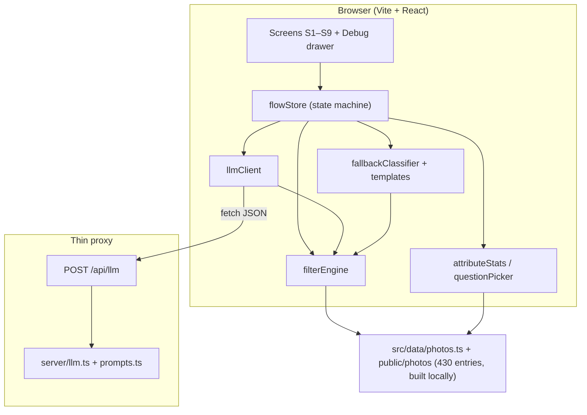

# System Architecture: Intent Clarifier Prototype

> **References:** [`PRD.md`](./PRD.md) (functional spec, build plan), [`edge cases.md`](./edge cases.md) (behavioural defaults and P0/P1 expectations).  
> **Scope:** Front-end prototype with a thin LLM proxy. No real Google Photos backend, auth, or on-device vision.

---

## 1. Purpose and constraints

The Intent Clarifier sits inside **Ask Photos** and turns a vague query into a **search intent profile** through guided MCQs (plus optional typed answers). Search over the mock library is **100% deterministic**; the LLM handles language understanding, question wording, and attribute selection hints—not photo retrieval.

| Constraint | Implication |
|---|---|
| 430-entry mock library (`photos.ts`) | All filters, stats, and baselines are computed client-side |
| ~400 JPEGs from Unsplash (build-time) | `npm run build:library` + `UNSPLASH_ACCESS_KEY`; runtime app reads local `/public/photos` only |
| API keys never in browser | LLM: `POST /api/llm`. Unsplash key used only by the library build script |
| Demo must work offline | Mock mode + rule-based fallbacks (`VITE_USE_MOCK_LLM`, E-10.1) |
| Grounding rule (PRD 6.6) | MCQ options only from `attributeStats`; invented values dropped (E-10.6) |

**Key constants** (`src/config.ts`): `REFERENCE_DATE` = 2026-10-05, `EARLY_STOP_AT` = 12, `THIRD_LEVEL_ABOVE` = 30.

---

## 2. High-level architecture



**Separation of concerns**

| Layer | Responsibility | Spec |
|---|---|---|
| **Presentation** | Phone frame, question cards, results grid, viewer | PRD §7 |
| **Orchestration** | Stages, profile, loop-back, early stop | PRD §5, §8.5; edge §7, §9 |
| **Deterministic search** | Filter, score, baseline, timeline crawl | PRD §6.1–6.4, FR-4; edge §6 |
| **LLM adapter** | Classify, next question, interpret typed text | PRD §6.5–6.6; edge §2, §5, §10 |
| **Proxy** | Provider call, Zod validation, retries | PRD §6.6; edge §10 |

---

## 3. Runtime topology

```
┌─────────────────────────────────────────────────────────────┐
│  Desktop: PhoneFrame (390×844) + DebugDrawer (docked)       │
│  ┌─────────────────────────────────────────────────────┐   │
│  │  React tree: Home → Query → Classify → Clarifier →   │   │
│  │  Results → Viewer / Success / Loop-back / Fallback   │   │
│  └─────────────────────────────────────────────────────┘   │
│         │                    │                              │
│         ▼                    ▼                              │
│   filterEngine          llmClient ──HTTP──► /api/llm        │
│   attributeStats              │              │              │
│   questionPicker              └── cache ─────┘              │
└─────────────────────────────────────────────────────────────┘
                              │
                              ▼
                    LLM provider (env: LLM_API_KEY, LLM_MODEL)
```

- **Development:** Vite dev server serves the SPA and mounts proxy middleware (or companion Express on another port—one integration path only).
- **Production demo:** Same split: static assets + small Node handler for `/api/llm`.
- **No persistence:** Refresh resets flow (E-12.1). LLM response cache may survive in memory until reset (E-10.9).

---

## 4. User-flow state machine

Canonical stages from PRD §8.5, aligned with screens §7:

```
HOME → QUERY → CLASSIFYING → LEVEL1 → LEVEL2 → LEVEL3 → SEARCHING → RESULTS
                                                      ↓
                    SUCCESS ← Photo viewer
                    LOOPBACK → LEVEL2 (re-weight, relax filters)
                    FALLBACK (after 2 loop-backs, FR-13)
```

**Core state** (`FlowState`):

| Field | Role |
|---|---|
| `stage` | Current screen / transition guard |
| `query`, `queryClass` | Raw text + one of `people \| nonPeople \| both \| text` |
| `profile` | `Partial<Record<Attr, value \| 'any'>>` (`'any'` = Can't remember) |
| `candidates` | Current photo set (derived, recomputed on every profile change) |
| `candidateHistory` | Count trail for debug and demo chip |
| `loopCount` | Loop-back limit (E-9.5) |
| `questionsThisRound` | Cap at 3 per round (FR-10, E-7.7) |
| `currentQuestion` / `answered` | Skip logic and loop-back exclusions (E-9.7) |

**Transition triggers**

| Event | Action |
|---|---|
| Query submit | Call 1 → apply `extracted` to profile → baseline candidates |
| Option tap / typed submit | Update profile → recompute candidates → early stop or next question |
| `candidates ≤ EARLY_STOP_AT` | Skip to search (E-7.3) |
| After level 2, `candidates > THIRD_LEVEL_ABOVE` | Enter level 3 (FR-11) |
| "Show results now" | Search with current profile (E-7.11) |
| "I did not find the photo" | FR-12: relax if &lt; 3 results; else new second-level attribute |
| "Start over" / debug Reset | Clear session; abort in-flight LLM (E-10.7, E-12.5) |

---

## 5. Query classes and question ladders

From PRD §6.1–6.2. First-level **attribute order is fixed**; from second level onward the LLM picks attribute (FR-9) with entropy fallback.

| Class | First level | Second level | Third level (if &gt; 30 after L2) |
|---|---|---|---|
| `people` | Timeline, Location, Type of Photo | People count, Pose | Clothing colour, Background |
| `nonPeople` | Timeline, Location, Object | Time of day, Sky | Dominant colour, Activity |
| `both` | Timeline, Location, Object, Type of Photo | People count, Time of day | Pose, Background |
| `text` | Doc type, Timeline | Language, Content type | Layout, Page colour |

### Animal photos under `people`

Product intent (PRD §2 research: people & animals best recalled) is reflected in **`edge cases.md`**: pet and animal queries route through the **`people`** class, not `nonPeople`.

| Concern | Rule |
|---|---|
| **Classification** | "dog", "my cat", "poodle" → `people` (E-2.5, E-2.13). "me and my dog" → `both` when human + scene implied (E-2.6). |
| **Library** | Animal-only entries (e.g. p01, p25) keep `peopleCount: 0`; they still appear in `people`-class candidate sets when the query/profile matches `animals[]`, `objects`, or keywords (E-11.5). |
| **Call 1 extraction** | Populate `extracted.objects` and/or a dedicated `animals` field in the classify schema so `filterEngine` can narrow to pets without requiring `hasPeople`. |
| **People-count MCQ** | Skip when all candidates are animal-only (same spirit as E-4.4). |
| **Fallback classifier** | Animal keyword list → `people`, not `nonPeople` (edge §14). |

Human-only filters (`peopleCount`, pose) apply only when candidates include humans; mixed `both` flows split human attributes vs pet matching on `animals`.

---

## 6. Deterministic core

### 6.1 `filterEngine`

- Input: full library + intent profile (+ optional keyword pills).
- Output: filtered list, match scores for sort (matched attributes, then date desc, then id—E-8.10).
- **Timeline:** Relative buckets from `REFERENCE_DATE` (E-6.1); year pick applies ±1 year crawl (FR-4, E-6.5).
- **Optional fields:** Missing `timeOfDay`, `sky`, etc. = unknown; excluded from option stats and fail strict filters (E-11.1).
- **Safe filters:** If a filter would yield 0 candidates, undo and toast (E-7.2, E-3.3). Unknown locations from extraction may be kept as chips but not hard-filtered when empty (E-3.3).
- **Keywords:** Substring match on `objects`, `animals`, `alt` (E-5.3); zero-match keywords need user confirm (E-5.4).
- **People class + pets:** Baseline and profile filters for `people` queries must include animal-tagged entries when the query or extracted profile names a pet (E-11.5); do not require `hasPeople === true`.

### 6.2 `semanticBaseline(query)`

Loose match for the "Without clarifier" chip (PRD §6.4): query tokens + synonym map against tags/`alt`. Computed independently of the profile.

### 6.3 `attributeStats` + `questionPicker`

For current candidates and allowed attributes:

- Value counts per attribute.
- Entropy per attribute (even splits → higher score).
- Skip question if &lt; 2 distinct values (E-4.4, E-4.5).
- Tie-break: fixed first-level order, then alphabetical (E-4.7).
- `fallbackPickNext`: highest entropy among unanswered allowed attrs—used when Call 2 fails or returns invalid attribute (E-10.5).

### 6.4 Grounding pipeline (Call 2 output)

```
LLM options → intersect with attributeStats keys → drop invalid
→ if &lt; 2 options remain → skip question (E-4.5)
→ render UI-added "Type your own" + "Can't remember"
```

---

## 7. LLM integration

### 7.1 Three calls (PRD §6.6)

| Call | When | Input highlights | Output highlights |
|---|---|---|---|
| **1 – Classify** | Query submit (S3) | `{ query }` | `class`, `extracted` (timeline, location, objects, **animals**, photoType, docType) |
| **2 – Next question** | Before each card (S4) | class, profile, `candidateCount`, `attributeStats`, `allowedAttributes`, `level` | `attribute`, `question`, `options[]`, `allowTyping` |
| **3 – Interpret typed** | FR-3a submit | text, current attribute, profile, `knownValues` | `updates[]`, `keywords[]`, `pillLabel` |

All responses: **strict JSON**, validated with Zod; retry once; then fallback (E-10.4).

### 7.2 Client behaviour (`llmClient.ts`)

- Typed operations: `classify`, `nextQuestion`, `interpretTyped` (single POST body discriminant or path—implementer choice).
- **`requestId`:** Monotonic per operation type; ignore stale responses after reset/back/force-class (E-10.7).
- **`AbortController`:** Cancel on navigation/reset (E-10.11).
- **Cache:** Key `(class, profile snapshot, level)` for Call 2 (E-10.9); invalidate on force-class or data change.

### 7.3 Timeouts and priority (edge vs PRD)

| Step | Behaviour |
|---|---|
| **Call 1** | Wait up to **6 s** for LLM; LLM result within 6 s **wins** over interim fallback (E-2.12). After 6 s, use `fallbackClassifier` and discard late Call 1. |
| **Call 2** | Skeleton UI; fallback template + entropy pick if slow/failed (E-10.12: &gt; 3 s → fallback for question step). |
| **Call 3** | On failure, treat raw text as keyword pill; never block flow (E-5.11). |

PRD §6.5 still mentions 4 s for Call 1; **implement per `edge cases.md` §14 (6 s, LLM priority).**

### 7.4 Mock and degraded mode

| Condition | Behaviour |
|---|---|
| No `LLM_API_KEY` or `VITE_USE_MOCK_LLM=true` | Rule classifier + template questions; badge in debug (E-10.1) |
| Proxy down | Same as mock for affected call; one toast (E-10.2) |
| 429 / 5xx | Retry ~500 ms, then fallback (E-10.3) |

### 7.5 Server (`server/`)

| Module | Role |
|---|---|
| `index.ts` | HTTP server, `POST /api/llm` only (E-10.10) |
| `llm.ts` | Provider SDK; swap model here (E-10.14) |
| `prompts.ts` | System prompts: short MCQs, JSON-only, respect profile |

Parse helpers: strip markdown fences, extract first JSON object (E-10.13).

---

## 8. Presentation layer

| Screen | Component(s) | Notes |
|---|---|---|
| S1 | `AskPhotosHome`, `SearchBar`, entry chip in `TopBar` | Query typed on home; no `QueryInput` screen |
| S2 | Classifying shimmer | Call 1 in flight; slow hint at 3 s |
| S3 | `ClarifierCard`, `TypedAnswerInput`, `roundPreview` | Up to 3 questions per round; draft + **submitRound**; Skip → results; no `ProfilePills` on clarifier |
| S4 | `ResultsGrid`, `ProfilePills` | Results + comparison chip |
| S5 | `ResultsGrid` | Real / gradient / document renderers (PRD §8.4) |
| S6–S7 | `PhotoViewer`, `SuccessScreen` | Baseline comparison chip |
| S8–S9 | `LoopBackCard`, fallback | Copy per FR-12/13 |
| Debug | `DebugDrawer` | Class, history, force-class, raw LLM, latency, reset |

**Layout:** `PhoneFrame` 390×844; scale down on narrow viewports (E-12.4). Debug drawer must not block frame taps (E-12.6).

---

## 9. Data model

Single source at runtime: **`src/data/photos.ts`** + files in **`public/photos/`**. Type `Photo` per PRD §8.4.

**Build pipeline (not in the browser):**

| Step | Module | Role |
|---|---|---|
| 1 | `scripts/build_library.ts` | Unsplash search/download (400 photos), deterministic metadata, demo planting |
| 2 | Output | `photos.ts`, JPEGs under `public/photos/` |
| 3 | Optional | `prototype-assets.zip` for offline legacy library |

Regenerate via **`npm run build:library`** when changing metadata rules; do not edit 430 rows by hand.

| Slice | Rendering |
|---|---|
| `kind: 'photo'`, non-null `src` | Image grid + viewer aspect from `width`/`height` |
| `kind: 'photo'`, `src: null` (legacy generated) | Gradient + emoji + `alt` |
| `kind: 'document'` | Paper card, `docType` only (E-11.4) |

Demo anchor: designated lake demo id (**legacy p10**): lily pads, Vancouver Island, 2026-10-02—only entry with `lily pads` in last-week lake cluster (PRD §8.4). Builder must preserve this invariant.

---

## 10. Cross-cutting concerns

### 10.1 Security

- `LLM_API_KEY` only on server; never `VITE_*` (E-10.10).
- `UNSPLASH_ACCESS_KEY` only for **`build:library`** (Node script / CI secret); never `VITE_*` and not required in production static hosting if assets are committed.
- Typed text is data, not instruction injection—schema-bound outputs only (E-5.8).
- Avoid logging full PII from typed answers outside debug (E-5.9).

### 10.2 Observability (prototype)

Debug drawer + console: per-call latency, fallback flags, candidate history, override log for force-class (PRD §4, E-2.11).

### 10.3 Accessibility and motion

Reduced motion (E-12.7); focus management on new cards (E-12.8); 44×44 targets (E-12.9).

---

## 11. Module map (recommended layout)

Aligns with PRD §8.2 (corrected nesting):

```
src/
  App.tsx
  config.ts                 # EARLY_STOP_AT, THIRD_LEVEL_ABOVE, REFERENCE_DATE re-export
  data/
    photos.ts
    questions.ts            # Template questions for fallback
  lib/
    llmClient.ts
    fallbackClassifier.ts
    schemas.ts
    filterEngine.ts
    attributeStats.ts
    questionPicker.ts
    semanticBaseline.ts
  state/
    flowStore.ts
  components/
    PhoneFrame.tsx
    AskPhotosHome.tsx
    QueryInput.tsx
    ClarifierCard.tsx
    TypedAnswerInput.tsx
    ProfilePills.tsx
    ResultsGrid.tsx
    PhotoViewer.tsx
    SuccessScreen.tsx
    LoopBackCard.tsx
    DebugDrawer.tsx
server/
  index.ts
  llm.ts
  prompts.ts
scripts/
  build_library.ts          # Unsplash fetch + photos.ts (build-time)
```

---

## 12. Critical paths (demo)

| Path | Architecture touchpoints |
|---|---|
| **A – "lake" + typed island/lily pads** | Call 1 → L1 filters → Call 3 multi-attribute → early stop → p10 in results |
| **B – Whistler loop-back** | Results &lt; 3 → relax Location → L2 timeOfDay → filterEngine |
| **C – friends / beach / receipt** | Class-specific L1 ladders; text path with pre-filled doc type |

---

## 13. Testing strategy (from edge §13)

| Area | Tests |
|---|---|
| `filterEngine` | Timeline, crawl, optional fields, keywords |
| `attributeStats` / `questionPicker` | Skip single-value, entropy ties |
| `flowStore` | 12 vs 13, 3-question cap, loop limit |
| `llmClient` | Mock proxy: invalid JSON, timeout, stale `requestId` |
| Data integrity | 430 ids, photo `src` files load, baseline counts |
| E2E | PRD demo paths A–C |

---

## 14. Spec alignment checklist

| Topic | PRD | Edge cases (authoritative where noted) |
|---|---|---|
| Early stop at 12 | FR-10 | E-7.3, E-7.4 |
| Third level &gt; 30 | FR-11 | E-7.8, E-7.9 |
| Call 1 timeout | §6.5 says 4 s | **6 s, LLM priority** (E-2.12, §14) |
| Animal photos under People | §8.4 `animals[]` | E-2.5, E-2.6, E-2.13, E-11.5 — class **`people`**, not `nonPeople` |
| Zero-result filters | Grounding | E-7.2, E-3.3, E-5.4 |
| Loop-back | FR-12, FR-13 | E-9.x |

When implementing, treat **`edge cases.md` P0 rows** as acceptance extensions to PRD §9.

---

## 15. LLM token budget (usability test)

**Scenario:** 5–6 participants × **2 runs** each → **10–12 full sessions**. Model example: **Claude Opus 4.5 / “Opus 5.5” medium** via the proxy (same three call types; PRD §6.6 caps each prompt at ~1k tokens by sending stats, not photo lists).

### Calls per session (typical)

| Call | When | Count per run (typical) | Count per run (heavy: loop-back + typing) |
|---|---|---:|---:|
| **1 – Classify** | Once per query | 1 | 1 |
| **2 – Next question** | Each clarifier card | 3–5 (early stop ~12) | 6–9 |
| **3 – Interpret typed** | Optional FR-3a | 0–1 | 1–2 |
| **Retries** | Invalid JSON / one retry | +0–1 total | +2–4 |

Demo script (PRD §10): Path A ≈ 1 + 3 Call 2 + 1 Call 3; Path B adds loop-back Call 2s. Two runs per person often mix lake + friends/receipt → **~5–8 Call 2** per session is a fair planning number.

### Tokens per call (order-of-magnitude)

Assumes compact JSON payloads and shared system prompts in `server/prompts.ts` (PRD ~1k-token ceiling on Call 2 inputs).

| Call | Input tokens | Output tokens |
|---|---:|---:|
| 1 – Classify | 500–800 | 80–150 |
| 2 – Next question | 650–950 | 120–250 |
| 3 – Interpret typed | 450–750 | 80–150 |

Call 2 dominates cost. `(class, profile, level)` **cache** (E-10.9) avoids repeat tokens on loop-back for identical state; prefetch (optional) can add ~1 extra Call 2 per card if not deduplicated — budget +15% if prefetch is enabled.

### Total for 10–12 sessions

| Scenario | LLM calls (approx.) | Input tokens | Output tokens | **Total tokens** |
|---|---:|---:|---:|---:|
| **Light** (early stop, little typing, cache hits) | 45–55 | 30k–40k | 6k–9k | **~40k–50k** |
| **Expected** (PRD paths A–C, some typing) | 60–75 | 45k–60k | 10k–14k | **~55k–75k** |
| **Heavy** (loop-backs, retries, prefetch, debug force-class) | 85–100 | 65k–85k | 14k–20k | **~80k–105k** |

**Planning figure for 6 people × 2 runs:** about **60k–75k total tokens** (input + output), roughly **5k–7k tokens per full session**. That is modest in absolute terms but **Opus-class models consume quota faster per token** than Sonnet/Haiku; if other models are already at **~62%** of a shared Cursor or API pool, this prototype alone is unlikely to consume more than **~1–3%** of a 1M-token-scale monthly allowance — unless the remaining **38%** is very small.

### Recommendations

1. **Development:** `VITE_USE_MOCK_LLM=true` or a smaller model for most builds (PRD §6.6); reserve Opus for facilitator-led demos.
2. **Measure:** Log `input_tokens` / `output_tokens` per call in the debug drawer during the test; multiply by 12 for a hard number after day one.
3. **Cap risk:** Disable optional Call 2 prefetch for the test week; keep retries at one; use cache aggressively.

---

## 16. Out of scope (explicit)

Real Google Photos APIs, auth, geocoding/EXIF, server-side photo storage, production scaling, persistent user sessions, and functional "Browse by Places" links (FR-13 placeholder).
